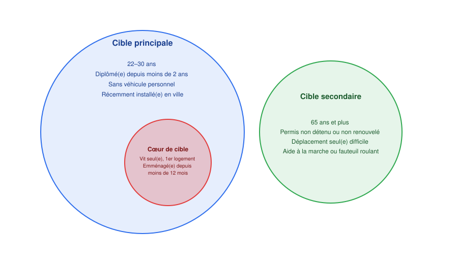
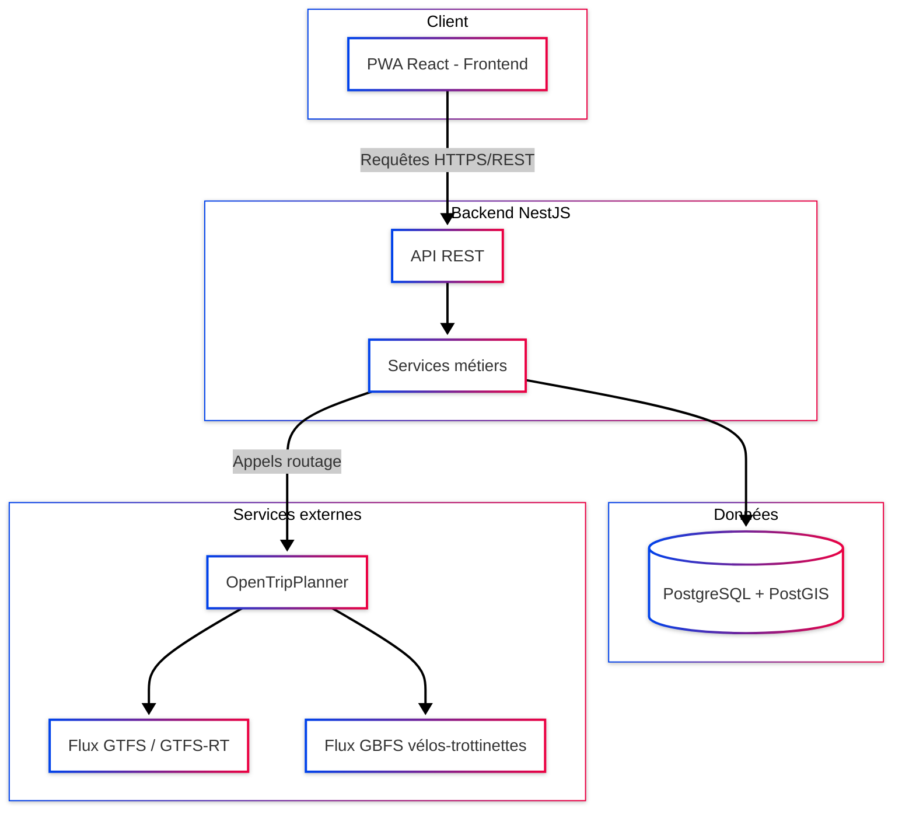
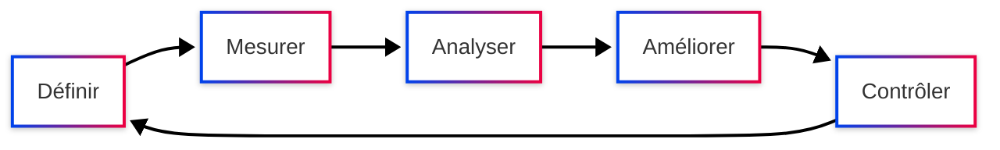
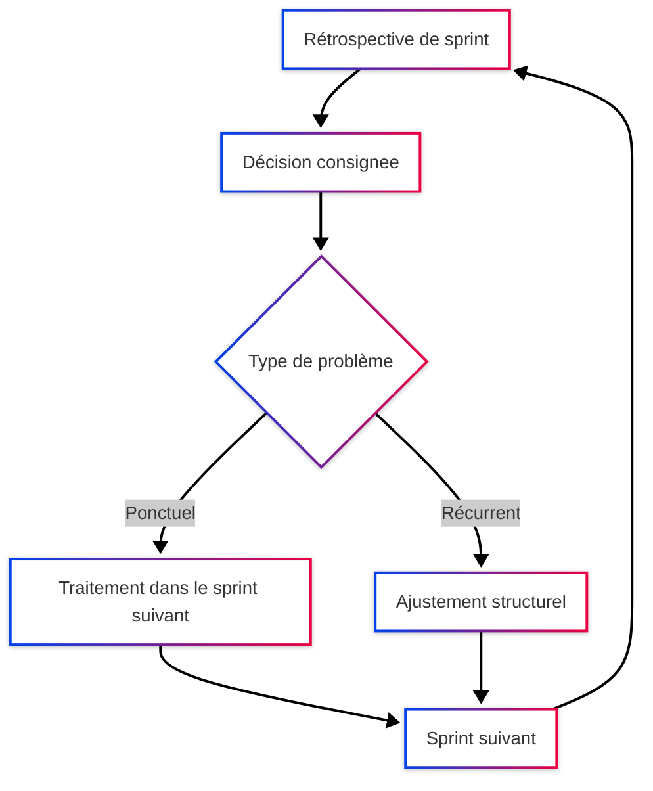
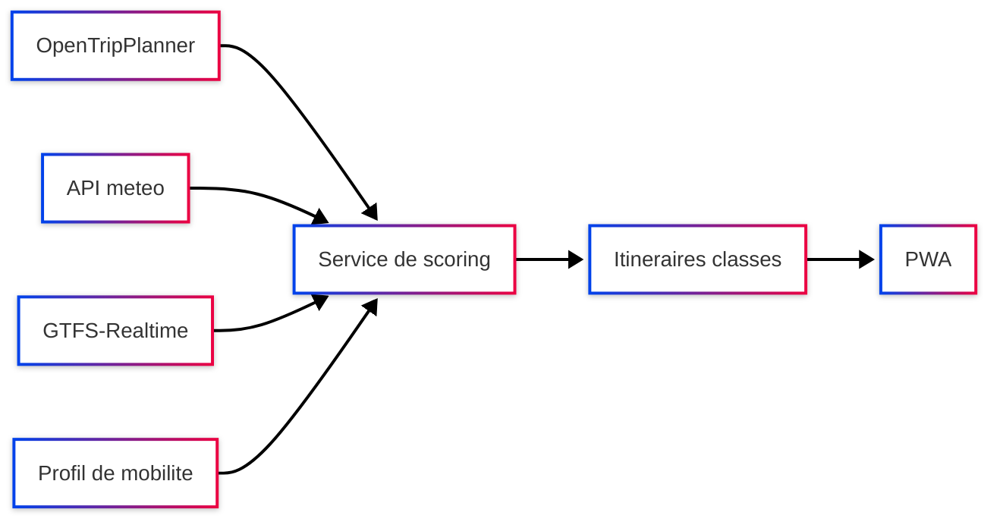
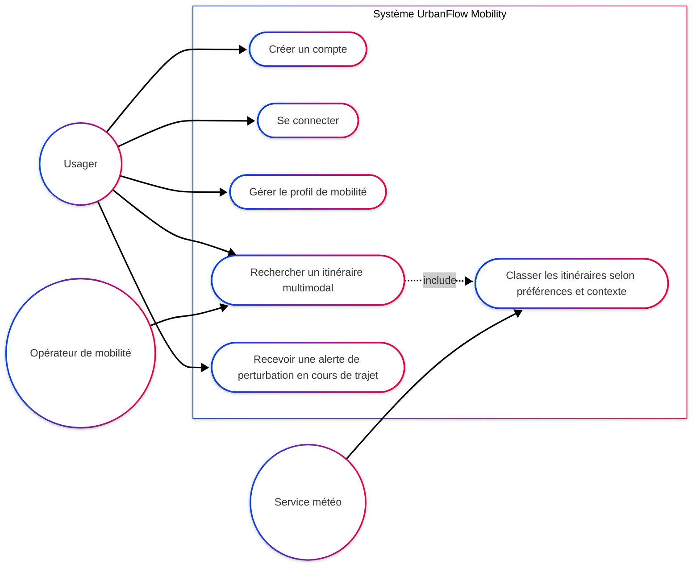
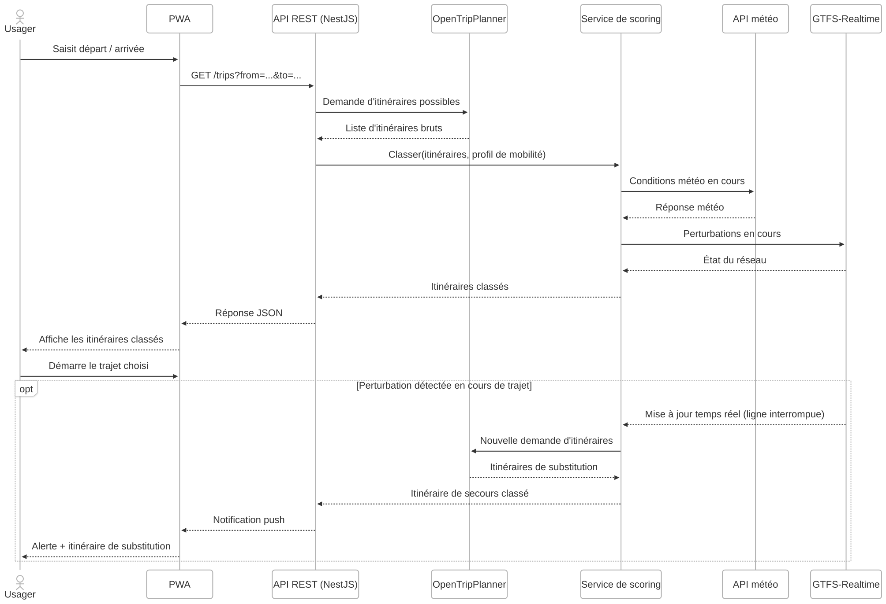
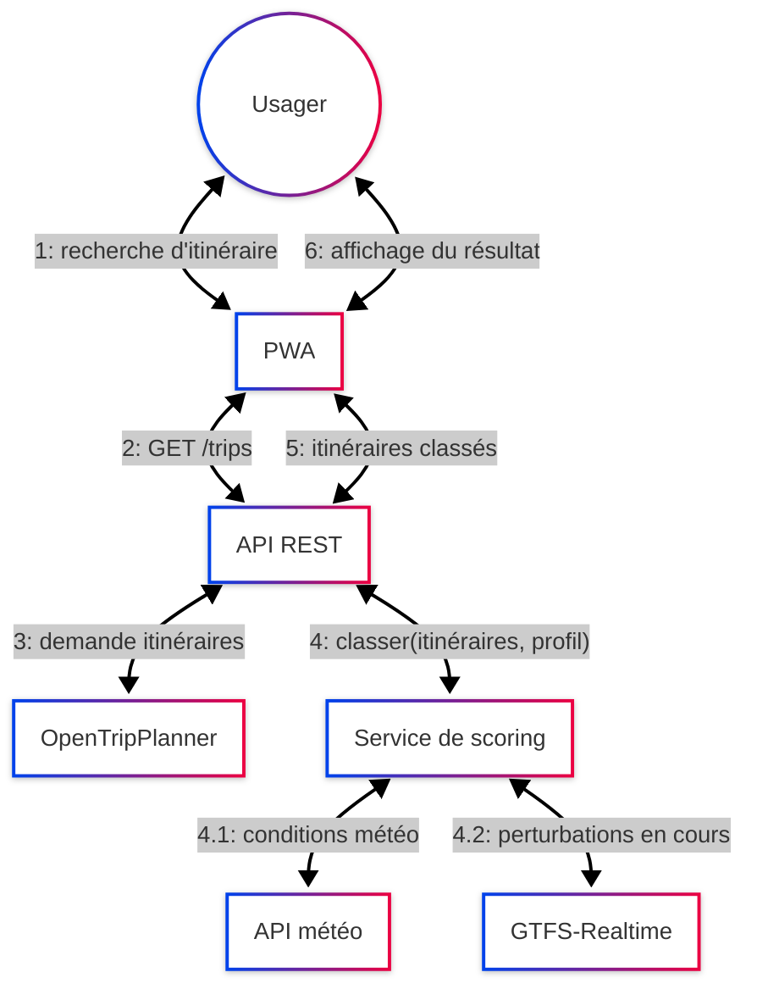
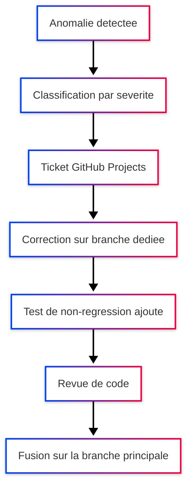
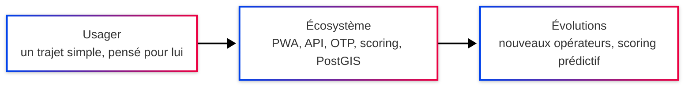

---
puppeteer:
  format: "A4"
  margin:
    top: "1.5cm"
    bottom: "1.5cm"
    left: "1.5cm"
    right: "1.5cm"
  printBackground: true
  displayHeaderFooter: true
  headerTemplate: '

'
  footerTemplate: '
 / 
'
---

  
Bachelor Concepteur Développeur de Solutions Digitales — Titre 6 (RNCP 36146)

  <h1 class="cover-title">UrbanFlow Mobility</h1>
  
Plateforme de mobilité urbaine intelligente

  

    
Dossier de projet — Session Septembre 2026

    
<strong>Yvan KERDANET</strong> B3 Développement — Digital Campus Paris

  

## Sommaire

1. [Introduction générale](#1-introduction-générale)
2. [Contexte et objectifs du projet](#2-contexte-et-objectifs-du-projet)
   - [2.1 Présentation du commanditaire et du contexte](#21-présentation-du-commanditaire-et-du-contexte)
   - [2.2 Analyse de la demande client](#22-analyse-de-la-demande-client)
   - [2.3 Cibles et personas](#23-cibles-et-personas)
   - [2.4 Enjeux métiers et objectifs économiques](#24-enjeux-métiers-et-objectifs-économiques)
   - [2.5 Recueil et hiérarchisation des besoins](#25-recueil-et-hiérarchisation-des-besoins)
   - [2.6 Anticiper les évolutions futures](#26-anticiper-les-évolutions-futures)
3. [État de l'art et recommandations technologiques](#3-état-de-lart-et-recommandations-technologiques)
   - [3.1 Benchmark concurrentiel des solutions de mobilité existantes](#31-benchmark-concurrentiel-des-solutions-de-mobilité-existantes)
   - [3.2 Standards de données de transport](#32-standards-de-données-de-transport)
   - [3.3 Moteur de calcul d'itinéraires multimodaux](#33-moteur-de-calcul-ditinéraires-multimodaux)
   - [3.4 Architecture applicative](#34-architecture-applicative)
   - [3.5 Architecture applicative : Full Stack intégré ou Frontend/Backend séparés](#35-architecture-applicative-full-stack-intégré-ou-frontendbackend-séparés)
   - [3.6 Benchmark des frameworks Frontend](#36-benchmark-des-frameworks-frontend)
   - [3.7 Benchmark des frameworks Backend](#37-benchmark-des-frameworks-backend)
   - [3.8 Benchmark des bases de données](#38-benchmark-des-bases-de-données)
   - [3.9 Benchmark des hébergeurs cloud](#39-benchmark-des-hébergeurs-cloud)
   - [3.10 Stack technique retenue — synthèse](#310-stack-technique-retenue--synthèse)
   - [3.11 Synthèse des arbitrages](#311-synthèse-des-arbitrages)
4. [Architecture globale et spécifications fonctionnelles](#4-architecture-globale-et-spécifications-fonctionnelles)
   - [4.1 Vue d'ensemble de l'architecture](#41-vue-densemble-de-larchitecture)
   - [4.2 Description des composants](#42-description-des-composants)
   - [4.3 Nomenclature et conventions](#43-nomenclature-et-conventions)
   - [4.4 Spécifications fonctionnelles des modules principaux](#44-spécifications-fonctionnelles-des-modules-principaux)
   - [4.5 Évolutivité et maintenabilité](#45-évolutivité-et-maintenabilité)
5. [Méthodologie de gestion de projet](#5-méthodologie-de-gestion-de-projet)
   - [5.1 Approche méthodologique retenue](#51-approche-méthodologique-retenue)
   - [5.2 Environnement et outils de travail](#52-environnement-et-outils-de-travail)
   - [5.3 Rôles et responsabilités](#53-rôles-et-responsabilités)
   - [5.4 Déroulement d'un cycle d'itération](#54-déroulement-dun-cycle-ditération)
6. [Démarche qualité et amélioration continue](#6-démarche-qualité-et-amélioration-continue)
   - [6.1 Indicateurs de qualité suivis](#61-indicateurs-de-qualité-suivis)
   - [6.2 Démarche d'amélioration continue](#62-démarche-damélioration-continue)
   - [6.3 Boucle de capitalisation](#63-boucle-de-capitalisation)
7. [Spécifications détaillées d'une fonctionnalité clé](#7-spécifications-détaillées-dune-fonctionnalité-clé)
   - [7.1 Présentation et objectifs de la fonctionnalité](#71-présentation-et-objectifs-de-la-fonctionnalité)
   - [7.2 Spécifications fonctionnelles](#72-spécifications-fonctionnelles)
   - [7.3 Spécifications techniques](#73-spécifications-techniques)
   - [7.4 Limites et évolutions possibles](#74-limites-et-évolutions-possibles)
8. [Diagrammes UML](#8-diagrammes-uml)
   - [8.1 Diagramme de cas d'utilisation](#81-diagramme-de-cas-dutilisation)
   - [8.2 Diagramme de séquence](#82-diagramme-de-séquence)
   - [8.3 Diagramme de communication](#83-diagramme-de-communication)
9. [Gestion des bogues et qualité de code](#9-gestion-des-bogues-et-qualité-de-code)
   - [9.1 Détection et priorisation des anomalies](#91-détection-et-priorisation-des-anomalies)
   - [9.2 Processus de correction](#92-processus-de-correction)
   - [9.3 Approche spécifique à la phase de préproduction](#93-approche-spécifique-à -la-phase-de-préproduction)
10. [Contraintes transverses (sécurité, RGPD, accessibilité, éco-conception, PWA, performance)](#10-contraintes-transverses)
    - [10.1 Sécurité des données](#101-sécurité-des-données)
    - [10.2 RGPD et données de géolocalisation](#102-rgpd-et-données-de-géolocalisation)
    - [10.3 Accessibilité (WCAG 2.1 AA)](#103-accessibilité-wcag-21-aa)
    - [10.4 Éco-conception](#104-éco-conception)
    - [10.5 PWA et performance en mobilité](#105-pwa-et-performance-en-mobilité)
11. [Conclusion et perspectives](#11-conclusion-et-perspectives)
12. [Annexes](#12-annexes)

---

## 1. Introduction générale

Je m'appelle Yvan Kerdanet, actuellement en troisième année de Bachelor Développeur à Digital Campus Paris, en vue d'obtenir le Titre 6 Concepteur Développeur de Solutions Digitales (RNCP 36146). Ce dossier présente le projet que j'ai mené dans ce cadre : UrbanFlow Mobility.

Le projet consiste à concevoir et développer une plateforme de mobilité urbaine intelligente pour une métropole de 500 000 habitants engagée dans sa transition écologique. L'objectif est de proposer aux citoyens un point d'entrée unique pour organiser leurs déplacements en combinant plusieurs modes de transport (vélos, trottinettes, transports en commun, covoiturage), tout en s'appuyant sur l'intelligence artificielle pour optimiser les trajets, réduire l'empreinte carbone et fluidifier le trafic urbain.

Cette étude retrace l'ensemble de la démarche suivie, depuis l'analyse du besoin client jusqu'aux choix techniques et méthodologiques retenus pour la conception et le développement de la solution.

---

## 2. Contexte et objectifs du projet

### 2.1 Présentation du commanditaire et du contexte

Le commanditaire du projet est une métropole de 500 000 habitants engagée dans une politique de transition écologique. Comme beaucoup de grandes agglomérations françaises et européennes, elle fait face à trois problématiques qui se renforcent mutuellement : une congestion routière chronique aux heures de pointe, un niveau de pollution atmosphérique et sonore préoccupant, et une offre de mobilité fragmentée où chaque mode de transport (bus, tram, vélos et trottinettes en libre-service, covoiturage) fonctionne avec ses propres outils, sans vision d'ensemble pour l'usager.

Dans ce contexte, la métropole souhaite se doter d'une plateforme unifiée capable de repenser la façon dont ses citoyens organisent leurs déplacements, en s'appuyant sur les technologies numériques et l'intelligence artificielle. Ce projet s'inscrit dans une démarche plus large de "Mobility as a Service" (MaaS), un modèle déjà expérimenté dans plusieurs villes européennes, qui vise à agréger l'ensemble des offres de mobilité au sein d'une application centrale.

### 2.2 Analyse de la demande client

La demande initiale, formulée par la responsable du projet côté métropole, liste une dizaine de fonctionnalités souhaitées :

- un planificateur d'itinéraires multimodaux
- un système de réservation unifié
- une IA d'optimisation des trajets en temps réel
- un système de gamification
- un module de covoiturage dynamique
- un suivi de l'empreinte carbone
- des alertes personnalisées
- un tableau de bord citoyen
- un signalement collaboratif des incidents

Si cette liste présente une idée assez juste du prérimètre, elle mélange néanmoins des besoins de nature différente : certains relèvent du **cœur de métier de la plateforme** (planifier et réserver un trajet), d'autres sont des **leviers d'engagement** (gamification, tableau de bord) et d'autres encore répondent à des **enjeux de fiabilité du service** (alertes, signalement). Une partie du travail de cadrage a donc consisté à distinguer, derrière la liste de fonctionnalités, les **besoins réels du commanditaire** : réduire la congestion et la pollution, attirer plus de monde vers le vélo, la trottinette, les transports en commun et le covoiturage, et donner à la collectivité une meilleure visibilité sur les usages pour orienter ses futurs investissements en infrastructure.

### 2.3 Cibles et personas

#### Cibles

La plateforme ne s'adresse pas de la même façon à tous les habitants de la métropole. Trois niveaux de ciblage sont définis pour orienter les priorités de conception : une cible principale, un cœur de cible plus précis à l'intérieur de celle-ci, et une cible secondaire à ne pas négliger.

**Cible principale — les jeunes actifs en début de carrière.** Il s'agit des habitants qui viennent de terminer leurs études ou d'obtenir leur premier emploi, entre 22 et 30 ans, diplômés depuis moins de deux ans, sans véhicule personnel et récemment installés en ville. C'est aussi une génération habituée avec les usages numériques et plus spontanément réceptive aux enjeux de mobilité durable, ce qui en fait un point d'entrée naturel pour la plateforme.

**Cœur de cible — les jeunes actifs en quête d'autonomie.** Au sein de cette cible principale, un sous-groupe se distingue plus particulièrement : celui des jeunes actifs vivant seuls dans leur premier logement, emménagés depuis moins de 12 mois, qui cherchent activement à gagner en autonomie dans cette nouvelle étape de leur vie — ne plus dépendre de leurs proches pour se déplacer, apprivoiser une ville qu'ils connaissent encore mal. Ce besoin d'autonomie correspond directement à ce que propose la plateforme : pouvoir organiser soi-même ses déplacements, sans connaissance préalable du réseau local. C'est ce sous-groupe qui devrait le plus naturellement adopter la plateforme et en devenir un usager régulier.

**Cible secondaire — les personnes âgées à mobilité réduite ou limitée.** Il s'agit des habitants de 65 ans et plus, qui ne détiennent plus de permis de conduire (ou ne l'ont pas renouvelé), pour qui se déplacer seuls est devenu difficile, et qui ont recours à une aide à la marche ou à un fauteuil roulant. Leurs attentes diffèrent nettement de la cible principale : une plateforme simple à utiliser, des informations fiables sur l'accessibilité des itinéraires, et une certaine tolérance à l'égard des usages numériques moins avancés. Cette cible reste secondaire dans les priorités de conception, mais elle justifie que l'accessibilité (voir [partie 10](#10-contraintes-transverses)) ne soit pas traitée comme une simple case à cocher réglementaire.

#### Personas

Les cibles définies ci-dessus prennent forme à travers deux personas, un pour chacune des cibles les plus déterminantes pour la conception de la plateforme.

Antoine incarne le cœur de cible : jeune actif en alternance, il a besoin d'autonomie immédiate dans une ville qu'il ne maîtrise pas encore, sans moyen de transport personnel. Sa présence dans le persona justifie que le planificateur d'itinéraires reste rapide et lisible dès la première utilisation, sans phase d'apprentissage.

Muriel incarne la cible secondaire : son profil illustre l'importance donné aux conditions d'accéssibilité — un trottoir dégradé/encombré ou l'absence de banc suffit à remettre en cause tout un trajet pour elle, alors que ces obstacles restent invisibles pour la majorité des autres usagers.

Ces deux profils seront repris tout au long du dossier pour justifier certains arbitrages, notamment dans la hiérarchisation des besoins qui suit ([partie 2.5](#25-recueil-et-hiérarchisation-des-besoins)).

### 2.4 Enjeux métiers et objectifs économiques

Trois enjeux sont identifiés pour structurer le projet du point de vue de la métropole :

- **Enjeu environnemental et de santé publique** :
  La réduction du trafic automobile individuel, combinée à une incitation forte vers des modes de déplacement plus doux comme le vélo, la marche ou les transports en commun, s'inscrit directement dans les objectifs de transition écologique portés par la collectivité. Cette évolution des usages est attendue avec des retombées concrètes sur la qualité de l'air et la réduction des nuisances sonores en milieu urbain.

- **Enjeu d'attractivité et de qualité de vie** :
  La fluidité des déplacements est un critère de plus en plus déterminant dans le choix d'implantation des habitants et des entreprises. Une plateforme de mobilité efficace constitue un point fort qui valorise l'attractivité de la métropole.

- **Enjeu économique et budgétaire** :
  Une meilleure répartition des usagers entre les différents modes de transport permet d'optimiser l'infrastructure existante plutôt que d'investir dans sa seule extension. Les données d'utilisation récupérées par la plateforme serviraient d'atout décisif pour orienter les décisions publiques futures (renforcement d'une ligne de bus, ajout de stations de vélos, etc.).

Ces enjeux justifient que la solution ne soit pas pensée comme un simple outil technique, mais comme un outil au service des décisions de la ville. Ce constat a orienté plusieurs choix fonctionnels détaillés dans les parties suivantes (notamment la priorité donnée au planificateur multimodal et au suivi carbone sur des fonctionnalités plus secondaires comme la gamification).

### 2.5 Recueil et hiérarchisation des besoins

À partir de la demande client, les besoins sont regroupés en trois niveaux de priorité.

**Besoins prioritaires (cœur de la solution)** : ce sont les besoins sans lesquels la plateforme n'a pas de valeur d'usage. Ils correspondent aux fonctionnalités obligatoires du cahier des charges : un système de gestion de compte et de profils de mobilité, un planificateur d'itinéraires multimodal avec géolocalisation en temps réel, et l'intégration des données de transport existantes (réseaux GTFS, opérateurs de vélos et trottinettes partagés). C'est exactement ce dont a besoin un usager comme [Antoine](#23-cibles-et-personas) dès sa première utilisation : un planificateur fiable, utilisable sans connaissance préalable du réseau local.

**Besoins secondaires (ce qui fait sortir du lot)** : ils enrichissent l'expérience une fois le socle en place, sans être indispensables à un premier usage. Il s'agit notamment de la réservation unifiée, de l'optimisation d'itinéraires par IA, du covoiturage dynamique, de la gamification, du calculateur d'empreinte carbone et du signalement collaboratif. Le cahier des charges impose d'en implémenter au moins une ; celle retenue pour ce projet est détaillée en [partie 7](#7-spécifications-détaillées-dune-fonctionnalité-clé).

**Besoins non fonctionnels et transverses** : ils ne sont pas visibles directement par l'utilisateur mais conditionnent la qualité et la conformité de la solution. Ils recouvrent la compatibilité PWA (installation, fonctionnement hors ligne partiel), l'ergonomie responsive, la sécurité des données conformément aux standards OWASP, le respect du RGPD pour les données de géolocalisation, l'accessibilité WCAG 2.1 AA pour les personnes à mobilité réduite, l'éco-conception, et la capacité de la plateforme à fonctionner correctement en situation de connectivité variable (usage mobile en ville). Ces contraintes sont reprises en détail en [partie 10](#10-contraintes-transverses), un point qui n'a rien d'accessoire pour un usager comme [Muriel](#23-cibles-et-personas), pour qui un trajet mal renseigné peut rendre tout le déplacement très compliqué voir impossible.

### 2.6 Anticiper les évolutions futures

Un des risques identifiés dès le cadrage est de concevoir une solution figée sur le périmètre initial, alors que le commanditaire est susceptible de faire évoluer ses attentes une fois la plateforme en service : ajout de nouveaux opérateurs de mobilité, extension à d'autres villes de la métropole, ouverture à des partenaires privés (parkings, loueurs de véhicules électriques), ou encore intégration de nouveaux capteurs urbains dans une logique de ville intelligente.

Cette anticipation a orienté deux décisions structurantes qui seront développées plus loin dans le dossier : le choix d'une architecture modulaire où chaque mode de transport est traité comme une source de données interchangeable plutôt que développer à la demande ([partie 4](#4-architecture-globale-et-spécifications-fonctionnelles)), et l'adoption d'une méthodologie de développement itérative permettant d'intégrer progressivement de nouvelles fonctionnalités sans remettre en cause l'existant ([partie 5](#5-méthodologie-de-gestion-de-projet)).

---

## 3. État de l'art et recommandations technologiques

### 3.1 Benchmark concurrentiel des solutions de mobilité existantes

Avant de faire des choix techniques, il est utile de regarder ce qui existe déjà sur le marché de la mobilité urbaine intelligente (MaaS, *Mobility as a Service*), pour situer UrbanFlow Mobility par rapport aux références du secteur.

| Solution | Points forts | Limites au regard du besoin |
|---|---|---|
| **Whim** (MaaS Global, Helsinki) | Pionnier du MaaS, abonnement unique multimodal | Modèle économique par abonnement complexe et coûteux à répliquer pour une métropole |
| **Citymapper** | Excellent planificateur multimodal, UX très aboutie | Pas de réservation, pas de paiement intégré, pas de suivi carbone, pas de gamification |
| **Moovit** | Très large couverture GTFS à l'international, temps réel fiable | Expérience assez générique, peu de personnalisation par IA |
| **Transit App** | Bonne intégration de la micro-mobilité (vélos, trottinettes) | Pas de covoiturage dynamique, ni de tableau de bord citoyen |

Aucune de ces solutions ne couvre l'ensemble du périmètre attendu par la métropole (planification multimodale, réservation unifiée, optimisation par IA, suivi carbone, gamification, signalement collaboratif). Cela confirme l'intérêt d'un développement sur-mesure plutôt qu'une solution en marque blanche, tout en s'inspirant de leurs bonnes pratiques (UX de Citymapper, couverture de données de Moovit).

### 3.2 Standards de données de transport

Le choix des sources de données conditionne fortement l'interopérabilité de la plateforme. Trois standards ouverts, largement adoptés par les opérateurs de transport, ont été retenus plutôt que des intégrations propriétaires :

- **GTFS** (*General Transit Feed Specification*) pour les horaires théoriques des transports en commun, standard de fait dans la quasi-totalité des réseaux urbains.
- **GTFS-Realtime**, extension du même standard, pour les perturbations et positions en temps réel des véhicules.
- **GBFS** (*General Bikeshare Feed Specification*) pour les données de vélos et trottinettes en libre-service, adopté par la plupart des opérateurs de micro-mobilité (Lime, Dott, Tier...).

S'appuyer sur ces standards plutôt que sur des connecteurs propriétaires par opérateur limite la dette technique et facilite l'ajout de nouveaux partenaires à l'avenir, dans la continuité de la logique d'évolutivité posée en [partie 2.6](#26-anticiper-les-évolutions-futures). *(Pour aller plus loin : origine et adoption de ces standards en [annexe A](#annexe-a-standards-de-données-de-transport).)*

### 3.3 Moteur de calcul d'itinéraires multimodaux

Le planificateur d'itinéraires est la fonctionnalité cœur de la plateforme. Trois approches ont été comparées :

| Option | Description | Avantages | Inconvénients |
|---|---|---|---|
| Développement d'un moteur de routage maison | Coder l'algorithme de calcul d'itinéraires multimodaux | Contrôle total | Complexité algorithmique disproportionnée pour un projet individuel, délai irréaliste |
| API commerciale (Google Routes API, HERE) | Externaliser le calcul d'itinéraires à un service tiers | Rapide à intégrer, fiable | Coût récurrent au volume d'appels, dépendance à un tiers, moins de finesse sur le multimodal spécifique à la ville |
| Moteur open-source auto-hébergé (OpenTripPlanner) | Déployer un moteur de routage existant, alimenté par les flux GTFS/GBFS de la métropole | Gratuit, personnalisable, données maîtrisées (cohérent avec le RGPD) | Effort de déploiement et de calibrage initial |

**Recommandation retenue : OpenTripPlanner (OTP).** Ce choix est argumenté par le fait qu'OTP gère nativement le calcul d'itinéraires combinant transport en commun, vélo et marche à partir de flux GTFS, qu'il est reconnu comme référence dans les projets MaaS académiques et municipaux, et qu'il évite une dépendance à un service tiers payant peu compatible avec un budget de collectivité sur le long terme. *(Fonctionnement technique détaillé en [annexe B](#annexe-b-comparatif-des-moteurs-de-routage).)*

### 3.4 Architecture applicative

Le cahier des charges impose une architecture PWA (*Progressive Web App*). Ce choix, indépendamment de son caractère imposé, reste le plus pertinent pour ce projet : une PWA permet de toucher aussi bien les usagers Android qu'iOS depuis une seule base de code, d'être installée sur l'écran d'accueil sans passer par un store, et de fonctionner en partie hors connexion — un point important pour un usage en mobilité avec une couverture réseau variable. Comparée à deux applications natives distinctes (Android et iOS), elle réduit aussi significativement les délais et les coûts de maintenance, ce qui est cohérent avec la logique budgétaire d'une collectivité.

### 3.5 Architecture applicative : Full Stack intégré ou Frontend/Backend séparés

| Approche | Description | Avantages | Inconvénients |
|---|---|---|---|
| Framework full-stack intégré (ex. Next.js, Django avec templates serveur) | Un seul projet gère à la fois l'interface et la logique serveur | Déploiement plus simple, un seul dépôt de code, moins de configuration initiale | Couplage fort entre front et back, plus difficile à faire évoluer indépendamment, peu adapté si un futur client mobile natif doit consommer les mêmes données |
| Frontend SPA + Backend API REST séparés | Deux projets distincts communiquant via une API | Scalabilité indépendante, API réutilisable (site web, future appli mobile, partenaires tiers), répartition claire des responsabilités, front et back peuvent avancer en parallèle sur des sprints distincts | Complexité de déploiement légèrement supérieure (deux services à maintenir), nécessite de documenter l'API |

**Recommandation retenue : architecture découplée (frontend SPA + backend API REST).** Ce choix répond directement à l'exigence d'interopérabilité du cahier des charges : la même API pourra, à terme, être consommée par d'autres canaux que la PWA (application mobile native, partenaires souhaitant intégrer les données de la plateforme). Il facilite aussi le travail en sprints décrit en [partie 5](#5-méthodologie-de-gestion-de-projet), front et back pouvant être développés en parallèle.

### 3.6 Benchmark des frameworks Frontend

| Framework | Avantages | Inconvénients |
|---|---|---|
| React | Écosystème très large, bon support PWA (Workbox, vite-plugin-pwa), bibliothèques cartographiques matures (react-leaflet) | Nécessite des bibliothèques tierces pour certains besoins (gestion d'état, routage) |
| Vue.js | Courbe d'apprentissage douce, bonne documentation, structure plus intégrée que React | Écosystème plus restreint pour les composants cartographiques spécialisés |
| Angular | Framework complet "batteries incluses", adapté aux grosses équipes | Verbeux, courbe d'apprentissage plus raide, plus lourd pour une PWA mobile-first |
| Svelte | Compilation en JavaScript natif, bundles très légers, bonnes performances runtime | Écosystème encore jeune, moins de bibliothèques cartographiques matures, communauté plus réduite |

**Recommandation retenue : React.** Justifié par la maturité de son écosystème PWA, la disponibilité de bibliothèques cartographiques éprouvées, et la taille de sa communauté qui facilite la maintenance du projet dans la durée.

### 3.7 Benchmark des frameworks Backend

| Framework | Langage | Avantages | Inconvénients |
|---|---|---|---|
| NestJS | TypeScript / Node.js | Même langage que le frontend, structure modulaire proche d'Angular, bon support REST, communauté active | Moins mature qu'un framework comme Spring Boot sur de très gros systèmes |
| Django | Python | Rapide à mettre en œuvre, ORM intégré, écosystème riche en bibliothèques géospatiales (GeoDjango) | Changement de langage par rapport au frontend |
| Spring Boot | Java | Très robuste, standard en environnement d'entreprise, même langage qu'OpenTripPlanner | Verbeux, courbe d'apprentissage plus longue, peu adapté à un développement rapide en solo |
| Laravel | PHP | Rapide à prendre en main, bon tooling | Écosystème moins pertinent pour un projet orienté données géospatiales |

**Recommandation retenue : NestJS (Node.js/TypeScript).** Partager le même langage que le frontend réduit les frictions de développement pour un projet porté par une seule personne, sans sacrifier la structure, ni la testabilité du code — un point clé lors de la revue de code.

### 3.8 Benchmark des bases de données

| Base de données | Avantages | Inconvénients |
|---|---|---|
| PostgreSQL + PostGIS | Support natif et mature des données géospatiales, modèle relationnel adapté aux liens entre utilisateurs/trajets/réservations, open-source | Nécessite une extension dédiée (PostGIS) à activer et maîtriser |
| MySQL | Très répandu, bonne performance en lecture | Support géospatial plus limité que PostGIS |
| MongoDB (NoSQL) | Flexible sur le schéma, adapté à des données peu structurées | Moins adapté aux relations complexes (utilisateur — trajet — réservation), requêtes géospatiales moins abouties que PostGIS |
| Firebase / Firestore | Mise en place très rapide, hébergement managé | Hébergé par défaut hors Europe, ce qui pose un problème direct de conformité RGPD pour des données de géolocalisation |

**Recommandation retenue : PostgreSQL + PostGIS.** Seule option combinant nativement un modèle relationnel adapté aux données du projet et un support géospatial de référence, sans compromis sur la localisation d'hébergement en Europe.

### 3.9 Benchmark des hébergeurs cloud

| Hébergeur | Avantages | Inconvénients |
|---|---|---|
| AWS / Google Cloud / Azure | Offre la plus large, tous les services disponibles, forte scalabilité | Hébergement par défaut hors UE pour une partie des services, question de souveraineté des données pour une collectivité française, empreinte carbone moins documentée publiquement |
| Scaleway | Hébergeur français, data centers en France, communication sur son efficacité énergétique, tarification prévisible | Offre de services managés moins large qu'AWS/GCP |
| OVHcloud | Hébergeur français/européen, très implanté auprès des collectivités, engagements environnementaux (refroidissement à eau) | Interface et outillage parfois moins aboutis que les géants américains |

**Recommandation retenue : Scaleway ou OVHcloud.** Ce choix répond directement à deux contraintes du cahier des charges : la RGPD (données hébergées en France/UE) et l'éco-conception (engagements environnementaux documentés), tout en restant cohérent avec le profil du commanditaire — une collectivité publique française.

### 3.10 Stack technique retenue — synthèse

| Brique | Choix retenu | Détaillé en |
|---|---|---|
| Architecture | Frontend SPA + Backend API REST | [3.5](#35-architecture-applicative-full-stack-intégré-ou-frontendbackend-séparés) |
| Frontend | React + Vite, Workbox pour le service worker | [3.6](#36-benchmark-des-frameworks-frontend) |
| Backend | NestJS (Node.js/TypeScript) | [3.7](#37-benchmark-des-frameworks-backend) |
| Base de données | PostgreSQL + extension PostGIS | [3.8](#38-benchmark-des-bases-de-données) |
| Moteur de routage | OpenTripPlanner | [3.3](#33-moteur-de-calcul-ditinéraires-multimodaux) |
| Hébergement | Scaleway ou OVHcloud | [3.9](#39-benchmark-des-hébergeurs-cloud) |
| Authentification | JWT avec refresh tokens, mots de passe hachés (bcrypt) | — |

### 3.11 Synthèse des arbitrages

| Arbitrage | Coût | Délai | Performance | Pérennité |
|---|---|---|---|---|
| Architecture découplée plutôt que full-stack intégré | Coût de développement équivalent | Sprints front/back en parallèle | Scalabilité indépendante des deux couches | API réutilisable pour de futurs canaux (mobile, partenaires) |
| React plutôt que Vue/Angular/Svelte | Pas d'écart significatif | Écosystème mature, prise en main rapide | Réactivité suffisante pour un usage mobile | Grande communauté, maintenabilité assurée |
| NestJS plutôt que Django/Spring Boot/Laravel | Pas d'écart significatif | Même langage que le frontend, un seul environnement à maîtriser | Performances adaptées à l'échelle du projet | Structure modulaire facilitant l'évolution du code |
| PostgreSQL/PostGIS plutôt que MySQL/MongoDB/Firebase | Solution open-source, pas de coût de licence | Mise en place légèrement plus longue (extension PostGIS) | Requêtes géospatiales natives et performantes | Solution mature, pas de dépendance à un hébergeur unique |
| OpenTripPlanner plutôt qu'API commerciale | Pas de coût récurrent à l'usage, coût d'hébergement maîtrisé | Déploiement initial plus long, mais pas de dépendance externe bloquante | Performances suffisantes pour l'échelle d'une métropole, calibrable | Solution open-source active, pérenne indépendamment d'un fournisseur tiers |
| PWA plutôt que natif double plateforme | Un seul développement au lieu de deux | Délai divisé par rapport celui de deux applications natives | Légèrement en retrait sur l'accès aux capteurs natifs, acceptable pour ce périmètre | Une seule base de code à maintenir dans le temps |
| Hébergement européen plutôt que cloud américain généraliste | Tarification comparable | Délai de mise en place équivalent | Performance équivalente pour un usage régional | Conformité RGPD native, réduit le risque réglementaire à long terme |

Ce tableau synthétise les arbitrages clés du projet et les principes qui les sous-tendent : préférer des solutions ouvertes, interopérables et hébergées en Europe plutôt que des solutions propriétaires plus rapides à mettre en œuvre mais plus risquées sur la durée.

---

## 4. Architecture globale et spécifications fonctionnelles

### 4.1 Vue d'ensemble de l'architecture

L'architecture retenue reprend les choix argumentés en partie 3 : une PWA côté client, une API REST côté serveur, et une séparation nette entre les couches applicatives pour préserver l'évolutivité de la solution.

Ce schéma en couches sépare clairement l'interface utilisateur, la logique métier et les données, avec le moteur de routage traité comme un service externe interchangeable — cohérent avec la logique d'évolutivité posée en [partie 2.6](#26-anticiper-les-évolutions-futures).

### 4.2 Description des composants

| Composant | Rôle | Détaillé en |
|---|---|---|
| PWA (React) | Interface utilisateur, planification et suivi des trajets, installation sur l'écran d'accueil | [3.6](#36-benchmark-des-frameworks-frontend) |
| API REST (NestJS) | Point d'entrée unique du backend, expose les ressources (utilisateurs, trajets, réservations) | [3.7](#37-benchmark-des-frameworks-backend) |
| Services métiers | Logique applicative (calcul d'itinéraire, gestion des réservations, calcul d'empreinte carbone) | — |
| Base de données (PostgreSQL/PostGIS) | Stockage des utilisateurs, trajets, réservations, données géospatiales | [3.8](#38-benchmark-des-bases-de-données) |
| OpenTripPlanner | Calcul des itinéraires multimodaux à partir des flux GTFS/GBFS | [3.3](#33-moteur-de-calcul-ditinéraires-multimodaux) |

### 4.3 Nomenclature et conventions

Pour garder une base de code lisible et homogène, une convention de nommage a été fixée dès le départ :

| Élément | Convention | Exemple |
|---|---|---|
| Endpoints API REST | Pluriel, kebab-case, verbes HTTP standards | `GET /trips`, `POST /reservations` |
| Tables de base de données | Pluriel, snake_case | `users`, `trip_segments`, `mobility_profiles` |
| Composants React | PascalCase | `TripPlanner`, `MobilityDashboard` |
| Services NestJS | Suffixe explicite du rôle | `TripService`, `ReservationService` |

Cette homogénéité facilite la lecture du code lors des revues et réduit le risque d'ambiguïté entre les différentes couches de l'application.

### 4.4 Spécifications fonctionnelles des modules principaux

| Module | Fonctionnalités couvertes | Type |
|---|---|---|
| Comptes et profils | Inscription, connexion, gestion du profil de mobilité (préférences de transport) | Obligatoire (F1) |
| Planification d'itinéraires | Recherche multimodale, géolocalisation en temps réel, affichage cartographique | Obligatoire (F2) |
| Intégration transport | Connexion aux flux GTFS et GBFS des opérateurs de la métropole | Obligatoire (F3) |
| Fonctionnalité complémentaire | Détaillée en [partie 7](#7-spécifications-détaillées-dune-fonctionnalité-clé) | Au choix |

Le profil de mobilité (F1) et le planificateur (F2) couvrent directement les besoins des deux personas présentés en [partie 2.3](#23-cibles-et-personas) : le premier permet de préciser des préférences comme l'évitement des escaliers ou un mode de transport prioritaire, utile pour un usager comme Muriel, tandis que le second doit rester utilisable sans apprentissage préalable du réseau, condition posée par le profil d'Antoine.

Le détail fonctionnel et technique complet de la fonctionnalité complémentaire retenue est traité spécifiquement en [partie 7](#7-spécifications-détaillées-dune-fonctionnalité-clé), pour éviter les redites : cette partie 4 se concentre sur l'architecture d'ensemble et les modules du socle commun.

### 4.5 Évolutivité et maintenabilité

Trois choix structurants garantissent que la plateforme peut évoluer sans réécriture majeure :

- **Découplage frontend/backend** ([partie 3.5](#35-architecture-applicative-full-stack-intégré-ou-frontendbackend-séparés)) : l'API pourra être réutilisée par un futur client mobile natif ou des partenaires, sans toucher au backend.
- **Moteur de routage en service externe** : chaque nouvel opérateur de mobilité s'intègre en publiant un flux GTFS ou GBFS conforme, sans modification du code applicatif — voir [partie 2.6](#26-anticiper-les-évolutions-futures).
- **Base de données relationnelle avec extension géospatiale** ([partie 3.8](#38-benchmark-des-bases-de-données)) : le modèle de données peut accueillir de nouveaux types de trajets ou de réservations par simple ajout de tables, sans remise en cause du schéma existant.

Cette architecture est pensée pour rester lisible et maintenable dans la durée, condition posée par le cahier des charges pour la partie spécifications.

---

## 5. Méthodologie de gestion de projet

### 5.1 Approche méthodologique retenue

Le cahier des charges impose une approche itérative du cycle de vie de la solution. Une approche Agile inspirée de Scrum a été retenue, adaptée au contexte d'un projet mené par une seule personne : le développement est organisé en sprints de deux semaines, chacun se terminant par une revue fonctionnelle et une rétrospective, plutôt qu'un développement en un seul bloc jusqu'à la livraison finale.

Ce choix permet d'intégrer progressivement les fonctionnalités obligatoires puis la fonctionnalité complémentaire (voir [partie 4.4](#44-spécifications-fonctionnelles-des-modules-principaux)), de détecter les points de friction tôt, et de garder une marge d'ajustement jusqu'à la fin du projet plutôt que de découvrir des problèmes structurants en toute fin de développement.

### 5.2 Environnement et outils de travail

| Besoin | Outil retenu | Usage |
|---|---|---|
| Gestion de version | Git / GitHub | Historique du code, branches par fonctionnalité |
| Suivi de l'avancement | GitHub Projects (tableau Kanban) | Backlog, sprint en cours, colonnes À faire / En cours / En revue / Terminé |
| Intégration continue | GitHub Actions | Lancement automatique des tests et du linter à chaque push |
| Tests d'API | Postman | Vérification manuelle et automatisée des endpoints REST |
| Tests unitaires | Jest (backend), Vitest (frontend) | Tests du backend NestJS et des composants React |
| Tests d'accessibilité end-to-end | Playwright + axe-core | Audit WCAG 2.1 AA en conditions réelles, exécuté automatiquement en CI |
| Documentation | README + Notion | Documentation technique du dépôt et suivi de projet |
| Design d'interface | Figma | Maquettes des écrans avant développement frontend |
| Assistance au développement | Assistant IA de codage | Accélération de l'écriture de code sous supervision directe, relecture et validation systématiques avant intégration |

Ces outils ont été choisis pour leur gratuité (ou leur plan gratuit suffisant à l'échelle du projet), leur bonne intégration avec la stack retenue en partie 3, et leur usage répandu dans l'industrie, ce qui limite le risque de dépendre d'un outil peu documenté ou abandonné.

Le recours à un assistant IA de codage mérite une précision : il est utilisé comme un outil d'accélération de la production de code, au même titre qu'un autocomplete avancé ou qu'un pair-programmeur, mais chaque ligne produite est relue, comprise et validée avant d'être intégrée. La responsabilité du code, sa correction et sa justification restent entièrement assumées dans le cadre du projet, y compris lors des revues de code en face-à-face.

### 5.3 Rôles et responsabilités

Le projet étant mené individuellement, chaque rôle habituellement porté par un membre d'équipe distinct est ici endossé en interne, sans répartition entre plusieurs personnes. Les distinguer reste utile : cela clarifie, à chaque instant du projet, sous quelle casquette une décision est prise, et permet de présenter clairement le fonctionnement du projet aux différentes parties prenantes (commanditaire, jury, futurs collaborateurs).

| Rôle | Responsabilités |
|---|---|
| Product Owner | Priorisation du backlog, arbitrages fonctionnels, relation avec le commanditaire |
| Développeur Frontend | Implémentation de la PWA React, intégration des maquettes Figma |
| Développeur Backend | Implémentation de l'API NestJS, intégration d'OpenTripPlanner et des flux GTFS/GBFS |
| Testeur / QA | Écriture et exécution des tests, revue de code |
| Référent qualité et sécurité | Vérification des critères OWASP, RGPD, accessibilité (voir [partie 10](#10-contraintes-transverses)) |

L'ensemble de ces rôles est assumé par une seule et même personne dans le cadre de ce projet individuel ; le découpage ci-dessus sert avant tout à structurer le raisonnement et à faciliter le dialogue avec le commanditaire sur qui fait quoi et à quel moment.

### 5.4 Déroulement d'un cycle d'itération

Chaque sprint de deux semaines suit le même déroulé, présenté ci-dessous.

- **Planning de sprint** : sélection des tickets du backlog à traiter, en fonction de leur priorité et de leur dépendance avec les fonctionnalités déjà livrées.
- **Développement** : implémentation par petites unités testables, commits réguliers sur des branches dédiées.
- **Revue de code** : relecture systématique avant fusion sur la branche principale, avec vérification du respect des conventions posées en [partie 4.3](#43-nomenclature-et-conventions).
- **Démo / revue fonctionnelle** : vérification que les fonctionnalités livrées répondent aux besoins exprimés en [partie 2](#2-contexte-et-objectifs-du-projet).
- **Rétrospective** : bilan du sprint, ajustements pour le sprint suivant — cette étape est reprise et approfondie en [partie 6](#6-démarche-qualité-et-amélioration-continue) dans une logique d'amélioration continue.

Ce cycle répété tout au long du projet permet d'assurer le bon déroulement des itérations de production demandé par le cahier des charges, tout en gardant une trace claire des décisions prises à chaque étape.

---

## 6. Démarche qualité et amélioration continue

### 6.1 Indicateurs de qualité suivis

La qualité n'est pas vérifiée une seule fois en fin de projet : elle est suivie tout au long du développement à travers quelques indicateurs simples, choisis pour rester réalistes à l'échelle d'un développeur unique plutôt que pour reproduire un dispositif de suivi pensé pour une grande équipe.

| Indicateur | Outil | Fréquence |
|---|---|---|
| Couverture de tests | Jest (backend), Vitest (frontend) | À chaque exécution de la CI |
| Conformité de style et détection d'erreurs statiques | ESLint / Prettier | À chaque commit (hook local) et à chaque push |
| Statut des tests automatisés | GitHub Actions | À chaque push |
| Anomalies remontées en test manuel | Postman + suivi GitHub Projects | À chaque sprint |
| Respect des critères transverses (sécurité, accessibilité, performance) | Revue manuelle ciblée | Avant chaque mise en production |

Ces indicateurs ne remplacent pas la relecture humaine du code, mais donnent un premier résumé objectif avant toute revue de code, et permettent de repérer une régression dès qu'elle apparaît plutôt qu'au moment de la livraison finale.

### 6.2 Démarche d'amélioration continue

La démarche qualité s'appuie sur la logique du cycle DMAIC (Définir, Mesurer, Analyser, Améliorer, Contrôler), habituellement utilisée en gestion de la qualité industrielle et transposée ici à l'échelle d'un sprint de développement : chaque itération part d'un objectif défini, s'appuie sur les indicateurs présentés en [partie 6.1](#61-indicateurs-de-qualité-suivis) pour mesurer l'état du produit, analyse les écarts constatés, met en œuvre des actions correctives ciblées, puis vérifie que ces actions tiennent dans la durée avant de passer au sprint suivant.

Cette logique rejoint l'esprit du Kaizen : privilégier une série de petites améliorations continues, décidées à chaque rétrospective, plutôt que d'attendre une refonte lourde en fin de projet. Elle s'articule directement avec le déroulement de sprint déjà posé en [partie 5.4](#54-déroulement-dun-cycle-ditération), où la rétrospective sert justement de point d'entrée à ce cycle : les constats de fin de sprint deviennent les objectifs du sprint suivant.

### 6.3 Boucle de capitalisation

Pour que chaque cycle profite réellement au suivant, les décisions prises en rétrospective sont consignées (README technique, tickets GitHub Projects), plutôt que de rester une remarque orale vite oubliée.

Deux cas sont distingués :

- une anomalie ponctuelle, traitée directement dans le sprint suivant et documentée dans la logique détaillée en [partie 9](#9-gestion-des-bogues-et-qualité-de-code) ;
- un problème récurrent (même type d'erreur qui revient, convention mal respectée), qui déclenche un ajustement plus structurel — évolution d'une règle de lint, ajout d'un test de non-régression, mise à jour d'une convention posée en [partie 4.3](#43-nomenclature-et-conventions).

Cette distinction évite de traiter chaque problème comme un cas isolé et permet à la démarche qualité de rester utile sur la durée du projet plutôt que de se limiter à un contrôle final avant livraison.

---

## 7. Spécifications détaillées d'une fonctionnalité clé

### 7.1 Présentation et objectifs de la fonctionnalité

La fonctionnalité complémentaire choisie est l'**optimisation d'itinéraires par IA en temps réel**, identifiée comme besoin secondaire en [partie 2.5](#25-recueil-et-hiérarchisation-des-besoins). Elle vient s'ajouter au planificateur multimodal de base ([partie 3.3](#33-moteur-de-calcul-ditinéraires-multimodaux)) plutôt que le remplacer : OpenTripPlanner reste responsable du calcul des itinéraires possibles à partir des flux GTFS/GBFS, et cette fonctionnalité ajoute une couche d'ajustement au-dessus, capable de tenir compte de conditions changeantes (perturbations, météo) et des préférences propres à chaque usager.

L'objectif n'est pas de calculer "LE" meilleur trajet dans l'absolu, mais le trajet le plus pertinent pour une personne donnée, à un instant donné. C'est exactement ce que recherche un usager comme [Antoine](#23-cibles-et-personas) : un trajet fiable proposé sans qu'il ait à comparer lui-même plusieurs options.

### 7.2 Spécifications fonctionnelles

Deux cas d'usage principaux sont couverts :

**Recherche avec classement personnalisé.** Lorsqu'un usager demande un itinéraire, plusieurs propositions issues du moteur de routage sont comparées et classées selon plusieurs critères, chacun avec un niveau d'importance réglable, plutôt que par le seul temps de trajet théorique :

| Critère | Exemple d'impact |
|---|---|
| Temps de trajet estimé | Critère de base, déjà fourni par le moteur de routage |
| Nombre de correspondances | Pénalise les trajets avec beaucoup de changements, sauf si l'usager les tolère |
| Conditions météo en cours | Déprioritise un trajet à vélo en cas de forte pluie annoncée |
| Perturbations en cours | Déprioritise une ligne signalée en incident via GTFS-Realtime |
| Préférences enregistrées | Priorise ou évite un mode de transport selon le profil de mobilité ([partie 4.4](#44-spécifications-fonctionnelles-des-modules-principaux)) |

**Ajustement en cours de trajet.** Si un incident survient après le départ (ligne interrompue, retard important), une notification est envoyée avec un itinéraire de substitution recalculé, plutôt que de laisser l'usager découvrir le problème une fois bloqué sur place — un point qui rejoint directement la situation vécue par [Muriel](#23-cibles-et-personas) lors d'un imprévu sur son trajet.

### 7.3 Spécifications techniques

Le service de scoring est un module backend dédié (NestJS), interrogé après chaque appel au moteur de routage. Il attribue à chaque critère du tableau précédent un niveau d'importance clair et modifiable, plutôt qu'un modèle de machine learning opaque : ce choix a été fait pour rester réaliste sur un projet individuel, tout en gardant un résultat justifiable et modifiable.

Ces niveaux d'importance par défaut sont calibrés manuellement, mais chaque usager peut les affiner via son profil de mobilité (par exemple, donner plus de poids à la fiabilité qu'à la rapidité). Le réajustement en cours de trajet s'appuie sur un abonnement aux mises à jour GTFS-Realtime : une perturbation détectée sur la ligne empruntée déclenche un nouveau calcul et une notification push vers la PWA.

### 7.4 Limites et évolutions possibles

Cette première version ne prédit pas le trafic à l'avance : elle réagit aux données disponibles au moment de la requête GTFS-Realtime plutôt que d'anticiper une perturbation avant qu'elle ne soit signalée. Un modèle prédictif plus poussé, entraîné sur un historique d'usage réel de la plateforme, est une évolution envisageable une fois suffisamment de données collectées — mais hors de portée réaliste pour la version initiale du projet. La qualité du classement dépend aussi directement de la fraîcheur des données météo et trafic fournies par les services tiers, ce qui en fait une dépendance externe à surveiller plutôt qu'une limite propre à la conception retenue.

---

## 8. Diagrammes UML

Trois diagrammes UML complémentaires sont présentés ci-dessous, modélisant chacun un angle différent du même parcours central de la plateforme : la recherche d'itinéraire avec classement personnalisé, spécifiée en [partie 7](#7-spécifications-détaillées-dune-fonctionnalité-clé).

### 8.1 Diagramme de cas d'utilisation

L'acteur principal est l'usager de la plateforme, qu'il s'agisse d'un profil comme Antoine ou comme Muriel ([partie 2.3](#23-cibles-et-personas)) : il crée un compte, se connecte, renseigne son profil de mobilité, puis recherche un itinéraire. Deux acteurs secondaires interviennent en soutien sans jamais interagir directement avec l'usager : l'opérateur de mobilité, qui alimente la recherche d'itinéraire via ses flux GTFS/GBFS ([partie 3.2](#32-standards-de-données-de-transport)), et le service météo, mobilisé uniquement par le cas d'usage de classement des itinéraires. Ce dernier cas d'usage est relié à la recherche d'itinéraire par une relation d'inclusion : on ne classe jamais un itinéraire sans qu'une recherche ait d'abord été effectuée — cette fonctionnalité correspond à celle détaillée en [partie 7](#7-spécifications-détaillées-dune-fonctionnalité-clé). Le cas d'usage "recevoir une alerte de perturbation" reste indépendant : il peut se déclencher à tout moment après le départ, sans action supplémentaire de l'usager.

### 8.2 Diagramme de séquence

Ce diagramme couvre les deux cas d'usage définis en [partie 7.2](#72-spécifications-fonctionnelles). La première moitié détaille le scénario nominal de recherche : l'usager ne dialogue qu'avec la PWA, tandis que l'API orchestre l'appel à OpenTripPlanner ([partie 3.3](#33-moteur-de-calcul-ditinéraires-multimodaux)) puis délègue le classement au service de scoring, qui interroge à son tour la météo et GTFS-Realtime avant de renvoyer une liste ordonnée — un enchaînement cohérent avec l'architecture en couches de la [partie 4.1](#41-vue-densemble-de-larchitecture). Le bloc optionnel qui suit illustre le second cas d'usage : si une perturbation est détectée après le départ, le service de scoring déclenche automatiquement un recalcul et une notification push, sans action de l'usager — le scénario concret vécu par [Muriel](#23-cibles-et-personas) lors d'un imprévu sur son trajet.

### 8.3 Diagramme de communication

Contrairement au diagramme de séquence, ce schéma met en avant les liens structurels entre les objets impliqués plutôt que leur enchaînement chronologique — chaque flèche représente un canal de communication, numéroté dans l'ordre des échanges. On y retrouve les mêmes composants que dans le diagramme de séquence de la [partie 8.2](#82-diagramme-de-séquence) et l'architecture posée en [partie 4.1](#41-vue-densemble-de-larchitecture) : la PWA ne communique qu'avec l'API REST, qui centralise les appels vers OpenTripPlanner et le service de scoring, ce dernier étant le seul point de contact avec les sources externes (météo, GTFS-Realtime). Les messages 4.1 et 4.2, imbriqués sous le message 4, montrent que ces deux appels sont déclenchés par le classement des itinéraires et non par l'API directement — une lecture que le diagramme de séquence rend moins immédiate.

---

## 9. Gestion des bogues et qualité de code

La gestion des bogues n'est pas traitée comme un contrôle final avant livraison, mais comme un processus continu, intégré au cycle de sprint déjà posé en [partie 5.4](#54-déroulement-dun-cycle-ditération) et prolongeant la logique d'amélioration continue de la [partie 6](#6-démarche-qualité-et-amélioration-continue).

### 9.1 Détection et priorisation des anomalies

Une anomalie peut être détectée à trois niveaux distincts : automatiquement par les tests unitaires (Jest) et le linter (ESLint/Prettier) exécutés à chaque push via GitHub Actions (voir [partie 5.2](#52-environnement-et-outils-de-travail)), manuellement lors des tests d'API sous Postman, ou remontée lors d'une démo de sprint. Quelle que soit son origine, chaque anomalie est classée selon sa sévérité avant d'être traitée :

| Sévérité | Exemple | Délai de traitement visé |
|---|---|---|
| Bloquante | Impossible de planifier un itinéraire | Immédiat, avant toute autre tâche du sprint |
| Majeure | Un critère de classement (partie 7.2) n'est pas pris en compte | Dans le sprint en cours |
| Mineure | Décalage visuel sur un écran secondaire | Sprint suivant, si la priorité le permet |

Cette classification évite de traiter chaque anomalie dans l'ordre d'arrivée : une anomalie bloquante sur le planificateur d'itinéraires (fonctionnalité cœur, [partie 4.4](#44-spécifications-fonctionnelles-des-modules-principaux)) prend toujours le pas sur un défaut mineur.

### 9.2 Processus de correction

Chaque anomalie donne lieu à un ticket dans GitHub Projects, traité sur une branche dédiée plutôt que directement sur la branche principale, dans la continuité des pratiques déjà posées en [partie 5.4](#54-déroulement-dun-cycle-ditération).

Une régression désigne un bogue déjà corrigé qui réapparaît plus tard, à cause d'une modification du code qui n'a a priori rien à voir avec lui. Exemple concret : un bogue empêche la prise en compte des perturbations GTFS-Realtime dans le classement des itinéraires ([partie 7.2](#72-spécifications-fonctionnelles)). Le correctif est accompagné d'un test qui vérifie précisément ce cas, et ce test reste ensuite en permanence dans la suite de tests, même une fois le bogue corrigé. Résultat : si une modification future du code venait à nouveau casser cette prise en compte, sans que personne ne s'en aperçoive directement, ce test échouerait automatiquement et alerterait avant la mise en production.

La fusion sur la branche principale reste enfin soumise à la même revue de code que n'importe quelle autre évolution.

### 9.3 Approche spécifique à la phase de préproduction

La phase de préproduction concentre une vigilance particulière, car c'est le dernier point de contrôle avant qu'un usager réel comme [Antoine](#23-cibles-et-personas) ou [Muriel](#23-cibles-et-personas) ne soit exposé à une régression. Trois pratiques structurent cette phase : un parcours de test manuel, où l'on utilise soi-même l'application comme le ferait un usager réel, sur un environnement proche de la production (mêmes flux GTFS/GBFS, mêmes contraintes réseau), un jeu de données réaliste plutôt que des données de test simplifiées, et un passage prioritaire sur les parcours critiques — inscription et profil de mobilité (F1), recherche d'itinéraire (F2), intégration transport (F3), et classement personnalisé par IA ([partie 7](#7-spécifications-détaillées-dune-fonctionnalité-clé)).

Un gel des nouvelles fonctionnalités est observé dans les derniers jours précédant chaque mise en production : seules les corrections de bogues bloquants ou majeurs sont encore acceptées, afin de ne pas introduire un nouveau risque au moment même où l'on cherche à en réduire.

---

## 10. Contraintes transverses (sécurité, RGPD, accessibilité, éco-conception, PWA, performance)

Ces contraintes s'appliquent à l'ensemble de la plateforme plutôt qu'à un module en particulier. Certaines ont déjà été évoquées ponctuellement dans le dossier (recueil des besoins en [partie 2.5](#25-recueil-et-hiérarchisation-des-besoins), choix d'architecture en [partie 3](#3-état-de-lart-et-recommandations-technologiques)) ; cette partie les rassemble et détaille comment chacune se traduit concrètement dans la conception.

### 10.1 Sécurité des données

La sécurité s'appuie sur les standards OWASP déjà mentionnés en partie 2.5, déclinés en pratiques concrètes : authentification par JWT avec refresh tokens et mots de passe hachés (bcrypt), déjà posée comme choix technique en [partie 3.10](#310-stack-technique-retenue--synthèse) *(fonctionnement détaillé en [annexe C](#annexe-c-authentification-jwt-et-refresh-tokens) et [annexe D](#annexe-d-hachage-des-mots-de-passe-avec-bcrypt))* ; validation systématique des données entrantes côté API pour se prémunir des injections ; communications chiffrées en HTTPS de bout en bout ; et une limitation du nombre de requêtes (rate limiting) sur les endpoints sensibles, notamment ceux liés à l'authentification.

Les données de géolocalisation méritent une vigilance particulière : elles permettent de reconstituer des habitudes de déplacement (domicile, lieu de travail, horaires), ce qui en fait une catégorie de données particulièrement sensible si elle venait à fuiter. *(Cartographie détaillée des risques en [annexe E](#annexe-e-cartographie-des-risques-sur-les-données-de-géolocalisation).)*

### 10.2 RGPD et données de géolocalisation

Le respect du RGPD repose sur trois principes appliqués dès la conception (privacy by design) : la minimisation des données collectées (ne conserver que ce qui est strictement nécessaire au fonctionnement du planificateur), une durée de conservation limitée des trajets individuels, et un droit à l'effacement accessible directement depuis le profil de mobilité.

Pour les besoins statistiques évoqués en [partie 2.4](#24-enjeux-métiers-et-objectifs-économiques) (orienter les décisions d'infrastructure de la métropole), les données utilisées seraient agrégées et anonymisées : la collectivité pourrait ainsi savoir qu'une ligne de bus est saturée aux heures de pointe sans que cela remonte à un usager identifiable. Ce traitement agrégé reste, à ce stade, un principe de conception plutôt qu'un tableau de bord livré : aucun canal dédié à la collectivité n'existe encore dans la version actuelle de la plateforme. L'hébergement en France ou en Europe, déjà justifié en [partie 3.9](#39-benchmark-des-hébergeurs-cloud), complète cette conformité en évitant tout transfert de données hors UE.

### 10.3 Accessibilité (WCAG 2.1 AA)

L'accessibilité n'est pas traitée comme une contrainte réglementaire à part, mais comme un besoin direct d'un usager comme [Muriel](#23-cibles-et-personas) : contrastes de couleurs suffisants, navigation complète au clavier, taille de police ajustable, textes alternatifs sur les éléments visuels, et compatibilité avec les lecteurs d'écran.

Cette exigence dépasse le seul champ de l'interface : le profil de mobilité (F1, [partie 4.4](#44-spécifications-fonctionnelles-des-modules-principaux)) permet déjà de signaler des contraintes concrètes prises en compte dans le calcul d'un trajet — accessibilité en fauteuil roulant, limitation de la distance de marche, limitation du nombre de correspondances. Le signalement d'obstacles ponctuels et changeants (un trottoir dégradé à un instant donné, par exemple) reste hors de portée réaliste pour cette version : il supposerait une source de données vivante sur l'état de la voirie, qu'aucun standard ouvert équivalent à GTFS/GBFS ne couvre aujourd'hui. *(Grille de conformité détaillée en [annexe F](#annexe-f-grille-de-conformité-wcag-21-aa).)*

### 10.4 Éco-conception

L'éco-conception s'appuie sur le référentiel RGESN (Référentiel Général d'Écoconception de Services Numériques), avec plusieurs leviers concrets : hébergement chez un fournisseur français aux engagements environnementaux documentés (Scaleway ou OVHcloud, déjà argumenté en [partie 3.9](#39-benchmark-des-hébergeurs-cloud)), allègement du frontend (chargement différé des composants peu utilisés, compression des assets), et mise en cache des résultats d'itinéraires récents pour limiter les appels redondants au moteur de routage.

Au-delà de ces leviers techniques, la plateforme sert par nature une cause écologique : chaque trajet reporté vers un mode de transport doux plutôt que la voiture individuelle constitue, à l'échelle de la métropole, un impact positif plus significatif que l'empreinte de l'application elle-même.

### 10.5 PWA et performance en mobilité

Le caractère PWA de la plateforme, déjà argumenté en [partie 3.4](#34-architecture-applicative), répond directement à un usage en mobilité où la connectivité varie constamment : un service worker met en cache les derniers itinéraires consultés et une partie des données cartographiques, pour rester utilisable même en cas de perte de connexion temporaire. L'application reste installable depuis le navigateur, sans passer par un store.

Le design responsive garantit une expérience cohérente quel que soit le support, ce qui compte directement pour un usager comme [Antoine](#23-cibles-et-personas), qui consulte la plateforme presque exclusivement depuis son téléphone. La performance sous connectivité variable est également recherchée activement, via le chargement progressif des données et un mode dégradé qui privilégie les informations essentielles (prochain trajet, alerte en cours) lorsque le réseau est faible.

---

## 11. Conclusion et perspectives

Il y a deux façons de regarder ce que devient UrbanFlow Mobility au terme de ce dossier.

- **Ce que voit l'usager :**

Antoine ouvre la PWA depuis son téléphone, sans rien installer depuis un store. Il renseigne un trajet et obtient des itinéraires déjà classé selon ses critère et préférences ([partie 7.2](#72-spécifications-fonctionnelles)).

Muriel, elle, retrouve dans son profil de mobilité la possibilité de signaler qu'elle évite les correspondances — une contrainte prise en compte dès le calcul d'itinéraire. Elle n'est pas placée dans une case accéssibilité ([partie 10.3](#103-accessibilité-wcag-21-aa)).

Un point de départ, une arrivée, un trajet qui tient compte de chaque utilisateur, ils ne sont pas placer derrières des profils préréglés. Ce que voit l'usager reste volontairement simple.

- **Ce qui le rend possible :**

Cette simplicité repose sur un écosystème que ce dossier a détaillé pas à pas : une PWA React qui dialogue avec une API NestJS, elle-même orchestrant OpenTripPlanner et ses flux GTFS/GBFS ([partie 3.3](#33-moteur-de-calcul-ditinéraires-multimodaux)), un service de scoring qui pondère selon la météo et le profil usager ([partie 7.3](#73-spécifications-techniques)), une base PostgreSQL/PostGIS conforme RGPD ([partie 10.2](#102-rgpd-et-données-de-géolocalisation)).

Chaque brique peut évoluer sans faire bouger les autres — un découplage posé dès la [partie 3.5](#35-architecture-applicative-full-stack-intégré-ou-frontendbackend-séparés).

> Concevoir une solution numérique, ce n'est pas seulement la faire fonctionner : c'est décider où placer la complexité pour qu'elle serve l'usager plutôt qu'elle ne lui soit imposée.

C'est cette manière de raisonner, plus que la stack technique retenue, qui recoupe directement les compétences visées par le Titre 6 Concepteur Développeur de Solutions Digitales.

Deux évolutions restent ouvertes pour la suite. L'ajout de nouveaux opérateurs ou l'extension à d'autres villes, qui ne demanderait qu'un flux GTFS/GBFS de plus à brancher sur un écosystème déjà pensé pour ça ([partie 4.5](#45-évolutivité-et-maintenabilité)). Et un service de scoring qui pourrait, une fois assez de données d'usage accumulées, évoluer vers un modèle prédictif ([partie 7.4](#74-limites-et-évolutions-possibles)).

Deux évolutions différentes, une même logique : faire grandir l'écosystème sans jamais complexifier ce que l'usager, lui, continue de voir.

---

## 12. Annexes

Les annexes qui suivent n'ont pas vocation à être lues pour comprendre les parties auxquelles elles se rattachent : chaque partie du dossier reste autonome, avec ses tableaux comparatifs et ses recommandations. Elles apportent un complément pour qui veut aller plus loin sur un point précis — origine d'un standard, fonctionnement détaillé d'un mécanisme de sécurité, ou grille de conformité — sans alourdir le corps du dossier.

- [Annexe A — Standards de données de transport, origine et adoption](#annexe-a-standards-de-données-de-transport)
- [Annexe B — Moteurs de routage : fonctionnement et déploiements réels](#annexe-b-comparatif-des-moteurs-de-routage)
- [Annexe C — Authentification JWT et refresh tokens, fonctionnement](#annexe-c-authentification-jwt-et-refresh-tokens)
- [Annexe D — Hachage des mots de passe avec bcrypt](#annexe-d-hachage-des-mots-de-passe-avec-bcrypt)
- [Annexe E — Cartographie des risques sur les données de géolocalisation](#annexe-e-cartographie-des-risques-sur-les-données-de-géolocalisation)
- [Annexe F — Grille de conformité WCAG 2.1 AA](#annexe-f-grille-de-conformité-wcag-21-aa)

### Annexe A — Standards de données de transport, origine et adoption

**GTFS.** Créé en 2005 à l'initiative de TriMet (l'autorité de transport de Portland, Oregon) en partenariat avec Google, sous le nom initial de "Google Transit Feed Specification". Le premier service Google Transit basé sur ce flux a été lancé le 7 décembre 2005 avec les seules données de TriMet ; cinq agences supplémentaires ont rejoint le dispositif dès 2006. En 2010, le standard a été renommé "General Transit Feed Specification" pour marquer son ouverture au-delà de Google, à mesure que son adoption s'accélérait. Aujourd'hui, plus de 10 000 opérateurs de transport dans le monde publient un flux GTFS, ce qui représente plus de 75 % des agences proposant des services de transport programmé.

**GBFS.** Créé en 2014 par Mitch Vars avec la collaboration d'opérateurs de vélo-partage, d'éditeurs d'applications et de fournisseurs technologiques. La version 1.0 a été portée par la NABSA (North American Bikeshare Association) et lancée en 2015. La gouvernance du standard a ensuite été confiée à MobilityData en 2019, avant un transfert complet de propriété en 2022. Le standard est aujourd'hui utilisé par plus de 730 systèmes de mobilité partagée dans plus de 40 pays.

**GTFS-Realtime.** Extension du GTFS statique au format Protocol Buffers (format binaire, plus compact qu'un CSV), publiée par Google quelques années après le GTFS initial pour couvrir les besoins de données temps réel (position des véhicules, retards, alertes).

Sources :
- [Predictors of Early Adoption of the General Transit Feed Specification — Findings Press](https://findingspress.org/article/57722-predictors-of-early-adoption-of-the-general-transit-feed-specification)
- [Advancing Adoption of General Transit Feed Specification (GTFS) — Caltrans](https://dot.ca.gov/-/media/dot-media/programs/research-innovation-system-information/documents/research-notes/task3515-rns-11-24-a11y.pdf)
- [NABSA selects MobilityData as the new home of the GBFS specification — MobilityData](https://mobilitydata.org/nabsa-selects-mobilitydata-as-new-home-of-the-gbfs-specification/)
- [GBFS — Get started](https://gbfs.org/get-started/)

---

### Annexe B — Moteurs de routage : fonctionnement et déploiements réels

**Fonctionnement d'OpenTripPlanner.** OTP construit un graphe de routage à partir des flux GTFS (réseau de transport en commun) et des données OpenStreetMap (réseau piéton et cyclable), puis calcule les itinéraires multimodaux avec l'algorithme RAPTOR (*Round-based Public Transit Routing*), conçu pour gérer efficacement les correspondances entre lignes. Les mises à jour GTFS-Realtime peuvent être injectées pour ajuster les itinéraires proposés en fonction des perturbations en cours.

**Déploiements existants.** OpenTripPlanner est utilisé en production dans plusieurs contextes proches de celui d'UrbanFlow Mobility : en France, il alimente les services de plusieurs agglomérations dont Grenoble, Rennes et Alençon. À l'échelle nationale, la Norvège (Entur, depuis 2017, jusqu'à plus de 20 requêtes par seconde en heure de pointe) et la Finlande (Digitransit, porté par l'autorité de transport d'Helsinki) s'appuient sur OTP pour l'ensemble de leur réseau. Ces exemples confirment que l'outil tient la charge à l'échelle d'une métropole, ce qui conforte le choix fait en [partie 3.3](#33-moteur-de-calcul-ditinéraires-multimodaux).

Sources :
- [OpenTripPlanner Deployments Worldwide — documentation officielle](https://docs.opentripplanner.org/en/latest/Deployments/)
- [OpenTripPlanner — dépôt officiel GitHub](https://github.com/opentripplanner/OpenTripPlanner)

---

### Annexe C — Authentification JWT et refresh tokens, fonctionnement

**Principe du JWT.** Un JSON Web Token est un jeton auto-porteur : signé par le serveur, il contient directement les informations nécessaires à son contrôle (identifiant utilisateur, date d'expiration) sans que le serveur ait besoin d'interroger une base de données à chaque requête pour vérifier une session. Cette approche sans état (*stateless*) est cohérente avec l'architecture découplée retenue en [partie 3.5](#35-architecture-applicative-full-stack-intégré-ou-frontendbackend-séparés), puisqu'elle facilite la scalabilité horizontale de l'API sans stockage de session partagé entre plusieurs instances du serveur.

**Deux jetons, deux durées de vie.** Le jeton d'accès (*access token*) est volontairement court (recommandation OWASP : entre 5 et 15 minutes selon la sensibilité des données), pour limiter la fenêtre d'exposition en cas de vol. Il est utilisé à chaque appel à l'API. Le jeton de rafraîchissement (*refresh token*), plus long à vivre, sert uniquement à obtenir un nouveau jeton d'accès une fois celui-ci expiré, sans redemander l'identifiant et le mot de passe à l'usager.

**Rotation du refresh token.** Pour limiter les conséquences d'un vol de jeton, l'OWASP recommande de faire tourner (*rotate*) le refresh token à chaque utilisation : un nouveau jeton est émis et l'ancien est immédiatement invalidé. Si un jeton déjà utilisé est présenté une seconde fois, cela signale une tentative de réutilisation frauduleuse (rejeu) et permet de révoquer l'ensemble de la session concernée.

Cette combinaison — jeton d'accès très court, refresh token à rotation, hébergement des données en France ([partie 3.9](#39-benchmark-des-hébergeurs-cloud)) — est particulièrement pertinente pour UrbanFlow Mobility, dont les données de géolocalisation figurent parmi les plus sensibles de la plateforme (voir [partie 10.1](#101-sécurité-des-données)) : réduire la durée de validité d'un jeton d'accès réduit d'autant la fenêtre pendant laquelle un jeton intercepté pourrait être exploité pour accéder à l'historique de déplacement d'un usager.

Sources :
- [JSON Web Token Cheat Sheet — OWASP](https://cheatsheetseries.owasp.org/cheatsheets/JSON_Web_Token_Cheat_Sheet.html)
- [OAuth2 Cheat Sheet — OWASP](https://cheatsheetseries.owasp.org/cheatsheets/OAuth2_Cheat_Sheet.html)

---

### Annexe D — Hachage des mots de passe avec bcrypt

**Hacher n'est pas chiffrer.** Un mot de passe n'est jamais stocké en clair, ni même chiffré (ce qui suppose une clé pour le déchiffrer) : il est haché, c'est-à-dire transformé par une fonction à sens unique impossible à inverser. Lors de la connexion, le mot de passe saisi est haché à nouveau et le résultat comparé au hachage stocké, sans que le mot de passe d'origine n'ait besoin d'être conservé nulle part.

**Le rôle du sel.** Chaque mot de passe est haché avec un sel (une valeur aléatoire unique, générée et gérée automatiquement par bcrypt) ajouté avant le hachage. Sans sel, deux usagers ayant le même mot de passe obtiendraient le même hachage, ce qui permettrait de le retrouver via des tables précalculées (*rainbow tables*). Avec un sel propre à chaque compte, deux hachages restent différents même pour un mot de passe identique.

**Le facteur de travail.** Contrairement à une fonction de hachage classique (rapide par nature), bcrypt est volontairement lent, et ce ralentissement est réglable via un facteur de travail (*work factor*) : plus il est élevé, plus le calcul est coûteux, ce qui ralentit d'autant les tentatives de force brute en cas de fuite de la base de données. La recommandation OWASP actuelle est un facteur de travail d'au moins 12, contre 10 par défaut dans la plupart des implémentations.

**Une limite à connaître.** L'OWASP recommande aujourd'hui Argon2 comme premier choix pour une nouvelle application, bcrypt restant cependant une option reconnue et largement supportée, en particulier dans l'écosystème Node.js/NestJS retenu en [partie 3.7](#37-benchmark-des-frameworks-backend). Ce choix reste donc un compromis assumé entre robustesse et simplicité d'intégration, plutôt que l'option la plus récente disponible.

Sources :
- [Password Storage Cheat Sheet — OWASP](https://cheatsheetseries.owasp.org/cheatsheets/Password_Storage_Cheat_Sheet.html)

---

### Annexe E — Cartographie des risques sur les données de géolocalisation

Cette cartographie détaille les principaux risques identifiés autour des données de géolocalisation, la catégorie de données la plus sensible de la plateforme (voir [partie 10.1](#101-sécurité-des-données)), et la solution retenue pour répondre à chacun.

| Risque | Scénario | Solution retenue |
|---|---|---|
| Interception réseau | Un trajet est capté en clair entre la PWA et l'API, par exemple sur un réseau Wi-Fi public non sécurisé | Chiffrement HTTPS de bout en bout sur l'ensemble des échanges ([partie 10.1](#101-sécurité-des-données)) |
| Fuite de la base de données | Un accès non autorisé à la base PostgreSQL/PostGIS expose l'historique de trajets de l'ensemble des usagers | Chiffrement des données sensibles au repos, accès à la base restreint aux seuls services qui en ont besoin |
| Ré-identification par recoupement | Même anonymisées, des données de trajets agrégées à un niveau trop fin (ex. un trajet domicile-travail unique) peuvent permettre de ré-identifier une personne | Agrégation à un niveau géographique et temporel suffisamment large avant tout usage statistique ([partie 10.2](#102-rgpd-et-données-de-géolocalisation)) |
| Compromission de l'appareil de l'usager | Le cache hors-ligne de la PWA (partie 10.5) contient les derniers trajets consultés ; un vol ou un accès physique au téléphone expose ces données | Durée de vie limitée du cache local, contenu minimal (pas d'historique complet, seulement les derniers trajets utiles au mode dégradé) |
| Exposition via un service tiers | Un appel mal conçu vers un service externe (météo, GTFS-Realtime) transmettrait une position précise plutôt qu'une zone générale | Les appels aux services tiers ([partie 7.3](#73-spécifications-techniques)) sont limités aux données strictement nécessaires à leur fonction, sans transmission de l'identité de l'usager |
| Accès interne excessif | Un accès trop large aux données de géolocalisation par l'équipe technique, au-delà du strict besoin de maintenance | Séparation des rôles ([partie 5.3](#53-rôles-et-responsabilités)) et traçabilité des accès aux données sensibles |

Cette cartographie reste volontairement centrée sur les scénarios les plus directement liés à l'architecture retenue dans ce dossier, plutôt que sur une analyse de risque exhaustive au sens d'une méthode formelle (EBIOS RM, STRIDE), hors de portée réaliste pour un projet individuel à ce stade de conception.

---

### Annexe F — Grille de conformité WCAG 2.1 AA

Le WCAG 2.1 (Web Content Accessibility Guidelines) est le référentiel de référence en matière d'accessibilité numérique, structuré en 50 critères de succès répartis sur trois niveaux (A, AA, AAA). Le niveau AA, évoqué en [partie 10.3](#103-accessibilité-wcag-21-aa), est le niveau généralement exigé dans les obligations légales (notamment l'obligation d'accessibilité numérique en France). Le tableau ci-dessous ne reprend pas les 50 critères mais sélectionne ceux qui ont une traduction concrète directe dans la conception d'UrbanFlow Mobility, pensée pour un usager comme [Muriel](#23-cibles-et-personas).

| Critère WCAG 2.1 | Exigence | Application dans UrbanFlow Mobility |
|---|---|---|
| 1.1.1 Contenu non textuel | Toute information non textuelle (icône, pictogramme, image) doit avoir une alternative textuelle | Les pictogrammes de mode de transport (bus, tram, vélo) et les icônes d'alerte sur la carte disposent d'un texte alternatif lu par les lecteurs d'écran |
| 1.4.3 Contraste (minimum) | Un rapport de contraste d'au moins 4,5:1 entre le texte et son arrière-plan | La charte graphique de l'application est vérifiée avec un outil de contrôle de contraste avant intégration, en particulier sur les badges de statut (perturbation, retard) |
| 1.4.4 Redimensionnement du texte | Le texte doit rester lisible et fonctionnel jusqu'à 200% de zoom, sans perte de contenu | L'interface est construite en unités relatives (rem/em) plutôt qu'en pixels fixes, pour permettre l'agrandissement sans rupture de mise en page |
| 1.4.10 Reflow | Le contenu doit se réorganiser sur un seul axe (pas de défilement horizontal) même à fort zoom ou sur petit écran | Cohérent avec le design responsive déjà posé en [partie 10.5](#105-pwa-et-performance-en-mobilité) : la mise en page s'adapte à la largeur disponible sans défilement horizontal |
| 1.4.11 Contraste des éléments non textuels | Les éléments d'interface (boutons, icônes, bordures de champs) doivent aussi respecter un contraste minimal | Les boutons d'action (lancer une recherche, valider un itinéraire) et les champs de formulaire conservent un contraste suffisant même hors état de focus |
| 2.1.1 Clavier | Toute fonctionnalité doit être utilisable au clavier seul, sans dépendre de la souris ou du tactile | Le parcours complet (recherche d'itinéraire, gestion du profil de mobilité F1) reste accessible par tabulation, ce qui profite aussi à un usage avec clavier externe sur tablette |
| 2.4.6 En-têtes et étiquettes | Les titres de section et les étiquettes de champs doivent décrire clairement leur contenu ou leur fonction | Les champs du profil de mobilité (préférences, obstacles à éviter) portent des libellés explicites plutôt que de simples icônes seules |
| 2.4.7 Visibilité du focus | L'élément actuellement sélectionné au clavier doit être visuellement identifiable | Un contour de focus visible est conservé sur tous les éléments interactifs, sans être supprimé pour des raisons esthétiques |
| 2.5.3 Label dans le nom | Le nom accessible d'un élément doit inclure le texte visible qui le désigne | Important pour la compatibilité avec les commandes vocales, pertinent pour un usage mains libres en mobilité comme celui d'[Antoine](#23-cibles-et-personas) |
| 3.3.1 / 3.3.2 Identification des erreurs et instructions | Les erreurs de saisie doivent être signalées clairement, et les champs doivent être accompagnés d'instructions | Le formulaire d'inscription et la recherche d'itinéraire indiquent explicitement le champ en erreur et la nature du problème, plutôt qu'un message générique |
| 4.1.2 Nom, rôle, valeur | Les composants d'interface personnalisés (carte interactive, sélecteurs) doivent exposer correctement leur état aux technologies d'assistance | Les composants non standards (carte, sélecteur de préférences du profil de mobilité) sont construits avec les attributs ARIA nécessaires plutôt qu'en HTML non sémantique |

Cette sélection n'a pas vocation à remplacer un audit d'accessibilité complet, mais à intégrer les critères les plus structurants dès la conception plutôt que de les traiter en correction a posteriori.

Sources :
- [W3C — Web Content Accessibility Guidelines (WCAG) 2.1](https://www.w3.org/TR/WCAG21/)
- [W3C — WCAG 2.1 Quick Reference (liste filtrable des critères de succès)](https://www.w3.org/WAI/WCAG21/quickref/)
